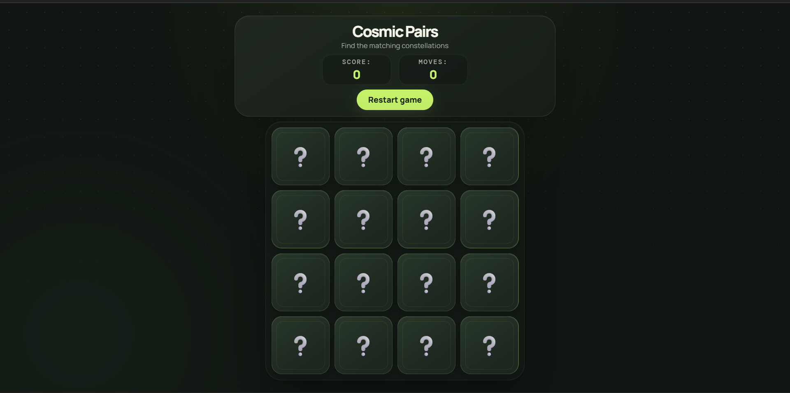

# 🌌 Cosmic Pairs — Memory Card Game



A clean, space-themed **memory matching game** built with React and Vite.  
Find all matching constellation pairs while tracking your score and moves.

---

## ✨ Features

- **Classic memory matching** — Flip cards to find matching pairs
- **Score & moves tracking** — Live score and move counter
- **Win celebration** — Congratulatory message showing total moves
- **Restart anytime** — One-click game reset
- **Smooth card animations** — Flip and match transitions
- **Responsive design** — Works well on mobile and desktop
- **Modern UI** — Dark cosmic theme with mint accents

---

## 🎮 How to Play

1. Click any card to flip it
2. Click a second card to try and find its match
3. Matching pairs stay face-up and increase your score
4. Non-matching cards flip back after a short delay
5. Match all pairs to win
6. Use **Restart game** to shuffle and play again

---

## 🛠️ Tech Stack

| Layer       | Tools                              |
| ----------- | ---------------------------------- |
| UI          | React 19                           |
| Build       | Vite 8                             |
| Styling     | Custom CSS (modern dark theme)     |
| State Logic | Custom React Hook (`useGameLogic`) |

---

## 📁 Project Structure

```
src/
├── components/
│   ├── Card.jsx          # Individual card with flip/match states
│   ├── GameHeader.jsx    # Title, stats, and restart button
│   └── WinMessage.jsx    # Victory message
├── hooks/
│   └── useGameLogic.js   # Core game state & logic
├── App.jsx
├── index.css
└── main.jsx
```

---

## 🚀 Getting Started

### Prerequisites

- Node.js 18+ (recommended)
- npm (or yarn / pnpm)

### Install & Run

```bash
# Clone the repository
git clone https://github.com/Souravbanerjeedata/memory-card-game-react.git
cd memory-card-game-react

# Install dependencies
npm install

# Start development server
npm run dev
```

Open the URL shown in the terminal (usually `http://localhost:5173`).

### Other Scripts

```bash
npm run build     # Production build
npm run preview   # Preview production build
npm run lint      # Run ESLint
```

---

## 🎯 Game Details

- **8 unique pairs** (16 cards total)
- Space-themed emoji set: 🌙 ⭐ 🪐 ☄️ 🛰️ 🌌 🔭 🌠
- Cards are shuffled on every game start / restart
- Locked board while checking a pair to prevent rapid clicking

---

## 📄 License

This project is open source and available under the [MIT License](LICENSE).

---

**Made with ❤️ by [Sourav Banerjee](https://github.com/Souravbanerjeedata)**
